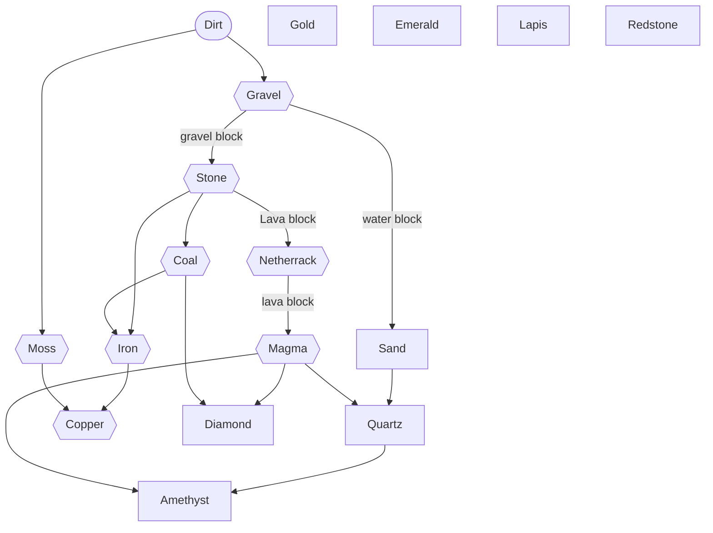

```mermaid
graph TD
    Dirt([Dirt])
    Gravel{{Gravel}}
    Stone{{Stone}}
    Coal{{Coal}}
    Iron{{Iron}}
    Magma{{Magma}}
    Netherrack{{Netherrack}}
    Quartz
    Sand
    Moss{{Moss}}
    Copper{{Copper}}
    Amethyst
    Diamond

    Gold
    Emerald
    Lapis
    Redstone
    
    Dirt --> Gravel
    
    Dirt --> Moss
    
    Gravel -- gravel block --> Stone

    Stone --> Coal

    Stone --> Iron
    Coal --> Iron
    
    Iron --> Copper
    Moss --> Copper

    Stone -- Lava block --> Netherrack
    
    Sand --> Quartz
    Magma --> Quartz
    
    Gravel -- water block --> Sand
    
    Magma --> Diamond
    Coal --> Diamond
    
    Netherrack -- lava block --> Magma
    
    Quartz --> Amethyst
    Magma --> Amethyst
```

