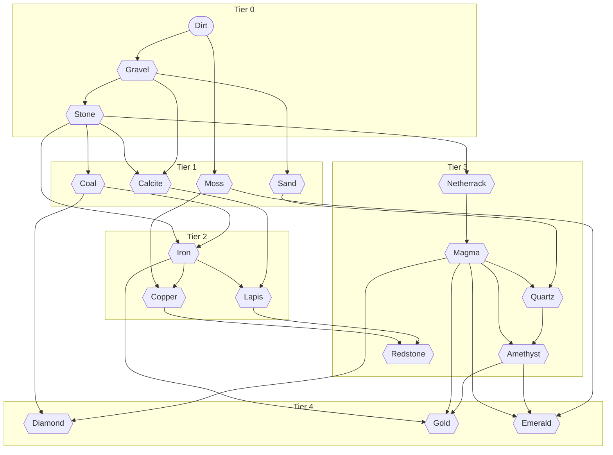

```mermaid
graph TD
    subgraph Tier 0
        Dirt([Dirt])
        Gravel{{Gravel}}
        Stone{{Stone}}
    end

    subgraph Tier 1
        Coal{{Coal}}
        Sand{{Sand}}
        Moss{{Moss}}
        Calcite{{Calcite}}
    end

    subgraph Tier 2
        Iron{{Iron}}
        Lapis{{Lapis}}
        Copper{{Copper}}
    end

    subgraph Tier 3
        Netherrack{{Netherrack}}
        Quartz{{Quartz}}
        Magma{{Magma}}
        Amethyst{{Amethyst}}
        Redstone{{Redstone}}
    end

    subgraph Tier 4
        Diamond{{Diamond}}
        Gold{{Gold}}
        Emerald{{Emerald}}
    end

    Dirt --> Gravel
    
    Dirt --> Moss
    
    Gravel --> Stone
    
    Gravel --> Calcite
    Stone --> Calcite
    
    Stone --> Coal
    
    Coal --> Iron
    Stone --> Iron
    
    Calcite --> Lapis
    Iron --> Lapis
    
    Iron --> Copper
    Moss --> Copper
    
    Stone --> Netherrack
    
    Sand --> Quartz
    Magma --> Quartz
    
    Gravel --> Sand
    
    Magma --> Diamond
    Coal --> Diamond
    
    Netherrack --> Magma
    
    Amethyst --> Gold
    Magma --> Gold
    Iron --> Gold

    Moss --> Emerald
    Amethyst --> Emerald
    Magma --> Emerald
    
    Quartz --> Amethyst
    Magma --> Amethyst
    
    Lapis --> Redstone
    Copper --> Redstone
```

