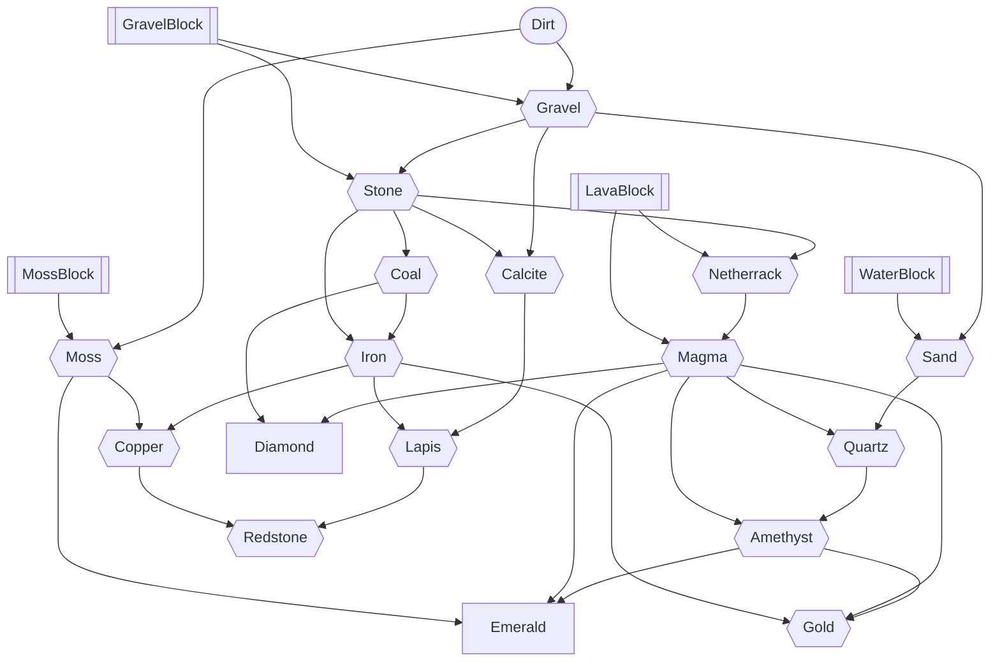

```mermaid
graph TD
    Dirt([Dirt])
    Gravel{{Gravel}}
    Stone{{Stone}}
    Coal{{Coal}}
    Iron{{Iron}}
    Magma{{Magma}}
    Netherrack{{Netherrack}}
    Quartz{{Quartz}}
    Sand{{Sand}}
    Moss{{Moss}}
    Copper{{Copper}}
    Amethyst{{Amethyst}}
    Calcite{{Calcite}}
    Diamond
    Gold{{Gold}}
    Emerald
    Lapis{{Lapis}}
    Redstone{{Redstone}}

    MossBlock[[MossBlock]]
    GravelBlock[[GravelBlock]]
    LavaBlock[[LavaBlock]]
    WaterBlock[[WaterBlock]]
    
    Dirt --> Gravel
    GravelBlock --> Gravel
    
    Dirt --> Moss
    MossBlock --> Moss
    
    Gravel --> Stone
    GravelBlock --> Stone
    
    Gravel --> Calcite
    Stone --> Calcite

    Stone --> Coal

    Coal --> Iron
    Stone --> Iron
    
    Calcite --> Lapis
    Iron --> Lapis
    
    Iron --> Copper
    Moss --> Copper

    Stone --> Netherrack
    LavaBlock --> Netherrack
    
    Sand --> Quartz
    Magma --> Quartz
    
    Gravel --> Sand
    WaterBlock --> Sand
    
    Magma --> Diamond
    Coal --> Diamond
    
    Netherrack --> Magma
    LavaBlock --> Magma
    
    Quartz --> Amethyst
    Magma --> Amethyst
    
    Amethyst --> Emerald
    Magma --> Emerald
    Moss --> Emerald
    
    Amethyst --> Gold
    Magma --> Gold
    Iron --> Gold
    
    Lapis --> Redstone
    Copper --> Redstone
```

